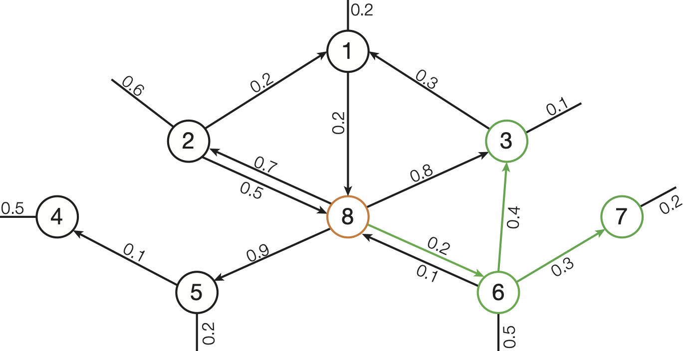

# FDE Bonus Project - K Nearest Neighbors

---
## Problem Description

In this project we work on a directed graph and implement an algorithm to find the _K Nearest Neighbors (knn)_ of a start node.

Each edge of the directed graph has a weight.
The K Nearest Neighbors are the `k nodes` (`result nodes`) with the cheapest path from `start node` to `result node`.
The cost of a path is the sum of all edges of the path.
The cheapest path is the one with the lowest cost.

---

**Figure 1:** *3-Nearest Neighbors search on a directed graph with start node 8. The result nodes are highlighted in green.*
---

For our example in **Figure 1** the 3-Nearest-Neighbors of `start node 8` are the result nodes: `(node: 6, cost: 0.2)`, `(node: 7, cost: 0.5)`, `(node 3, cost: 0.6)`.

For this project we are only interested in the K Nearest Neighbor nodes and the cost of their path as shown in the example result.
You do not need to keep track of the nodes on the path itself.

Please make sure your K Nearest Neighbors result:
- contains the weight of the cheapest paths from start node to each result node 
- contains no result node twice

---
## Your Task

Implement an efficient **K Nearest Neighbors** algorithm for a directed graph in the function **_getKNN()_**
in `include/KNN.hpp`. All solutions that compute correct results and achieve a time measurement better than **2
minutes** on the leaderboard will be accepted for the bonus. It is sufficient to implement a single-thead solution, you
do not need any parallelization.

Your implementation of `getKNN()` should return the K Nearest Neighbors as a vector of `Matrix::Entries`, where each Entry
consists of `column = the result node` and `weight = cost of the cheapest path from start node to this result node`.

### Code base & dataset

You only need to implement the *K Nearest Neighbors* algorithm itself in the function **_getKNN()_**. We provide you the
functions to read the graph file and create a matrix in ```include/Matrix.hpp```.  
The file also contains a description of the matrix structure and the dataset format. However, the only function of the
matrix you will need is ```getNeighbors()```.

#### Testing your solution

We provide you a smaller, but sufficient dataset (*~50MB*) in ```test/data/dataSmall.mtx``` to test your implementation,
a test suit ```test/data/GraphTests.cpp``` and a function for developmental and experimental use ```src/ForTesting```
(you probably won't need it).

You can run the test suit executing ```test_all```. To execute ```forTesting``` you have to provide the correct program
arguments: [CLion Tutorial](https://www.jetbrains.com/help/objc/add-environment-variables-and-program-arguments.html#add-program-arguments)
. The binary takes three arguments: <br>
```forTesting <absolute path> <start node> <k = number of nearest neighbors>``` <br>
Please provide the absolute file path and make sure it does not contain whitespaces. We provide an example in the
file ```src/ForTesting.cpp```.

Also, feel free to add tests if needed!

### Build

A configuration file is provided to build this project with CMake. This allows you to build the project
in the terminal but also provides the option to use Jetbrains CLion or Microsoft Visual Studio and other
IDEs.

Building from Terminal:
Start in the project directory.

```
mkdir -p build/debug
cd build/debug
cmake -DCMAKE_BUILD_TYPE=Debug ../..
make
```

This creates the binaries `test_all`, `bench` and `forTesting`.


